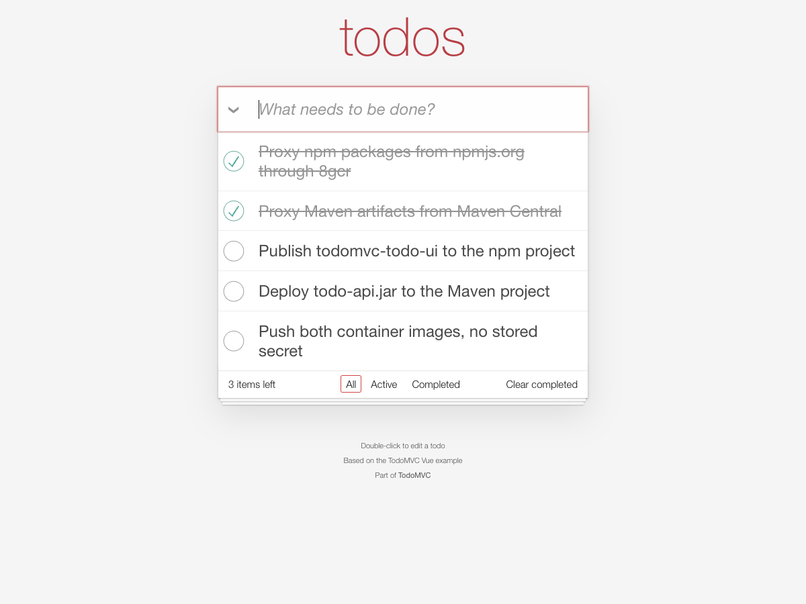
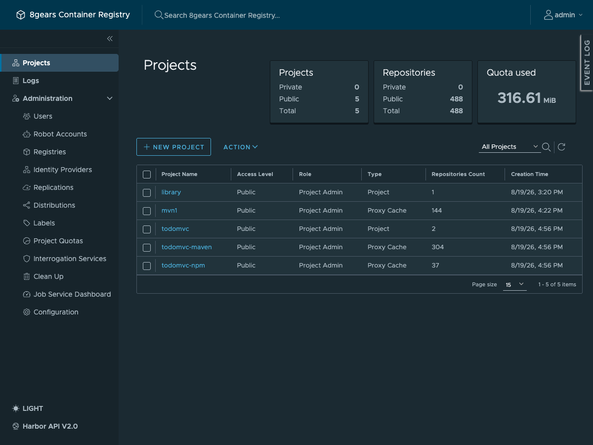
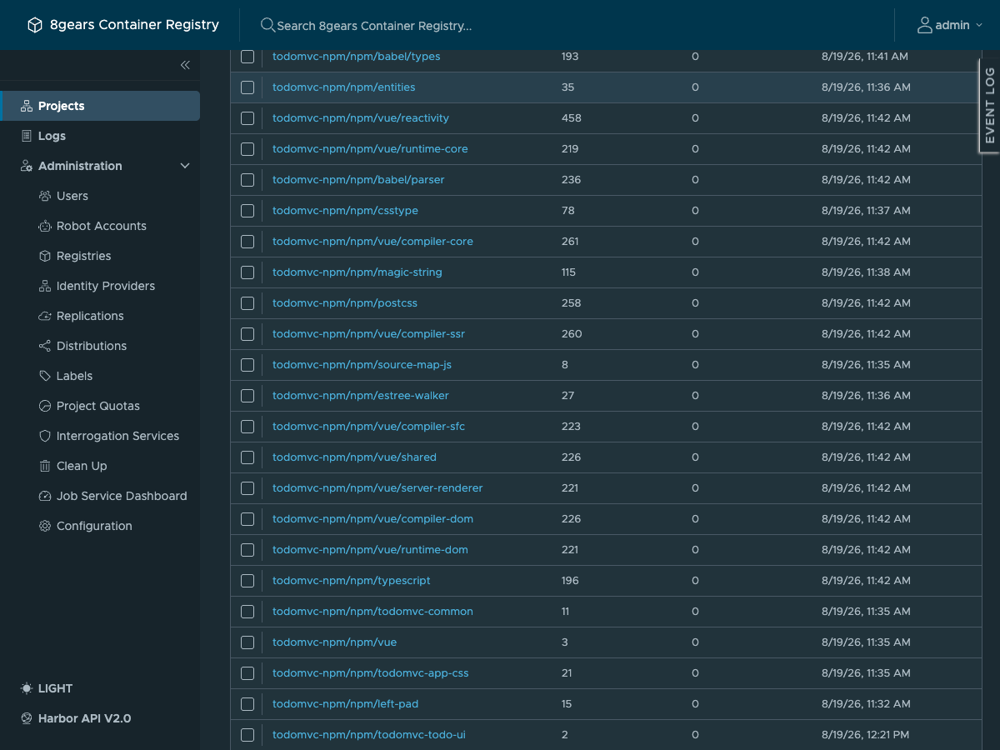

# 8gcr Harbor registry for npm, Maven and container images

A working example of using a single [8gcr](https://container-registry.com/8gcr) / Harbor
instance as the only artifact store a project needs:

- **proxy** npm packages from npmjs.org and Maven artifacts from Maven Central through it,
- **publish** your own npm package and Maven jar back into Harbor,
- **push and pull container images**,
- From one GitHub Actions pipeline, with **no registry secret stored anywhere**.

The two TodoMVC apps in `apps/` exist only to give the pipeline something real to build.
The artifact flow, the pipeline and the guide are the point.



Only need Maven? Start with [Maven hosted and proxy repositories](docs/maven-hosted-and-proxy.md).

## What you will actually see

One project per ecosystem, each acting as a pull-through cache for its upstream and as a
home for your own packages at the same time:



After a build, the npm project holds both the dependencies your build pulled from
npmjs.org and the package your pipeline published:



## Read it front to back

| | |
|---|---|
| [01: Concepts](docs/01-concepts.md) | Native hosting vs proxy cache, precedence, `proxy_cache_allow_push` |
| [02: Registry setup](docs/02-harbor-setup.md) | Endpoints, projects, federated identity, secretless robot |
| [03: npm](docs/03-npm.md) | Package it, publish it, proxy through it, pull it back |
| [04: Maven](docs/04-maven.md) | The same four steps for Maven |
| [05: Images and keyless auth](docs/05-images-wif.md) | Push and pull with no stored credential |
| [06: The pipeline](docs/06-pipeline.md) | The whole thing wired together in CI |
| [Maven quickstart](docs/maven-hosted-and-proxy.md) | Separate hosted and proxy projects, from empty setup |

## The five-minute path

Provision the registry side. This is idempotent, so re-running it is safe:

```bash
export HARBOR_URL=https://8gcr.container-registry.dev
export HARBOR_USER=admin HARBOR_PASS=...
export GITHUB_REPO=your-org/your-repo
./scripts/setup-8gcr.sh
```

It creates two proxy-cache registry endpoints, three projects, a federated identity
provider trusting GitHub's OIDC issuer, and a robot account that has **no secret** and can
only be assumed by a token carrying the right claims.

Then point your clients at it. npm (`apps/todo-ui/.npmrc`):

```ini
registry=https://8gcr.container-registry.dev/npm/todomvc-npm/
always-auth=true
```

Maven (`apps/todo-api/.mvn/settings.xml`) uses a wildcard mirror so plugin downloads are
covered too, not just dependencies:

```xml
<mirror>
  <id>8gcr</id>
  <mirrorOf>*</mirrorOf>
  <url>https://8gcr.container-registry.dev/maven/todomvc-maven</url>
</mirror>
```

Install, publish, read back. `npm run build` is not optional: `package.json` ships
`files: ["dist"]`, `dist` is not in git, and publishing without it succeeds with an
empty package at a version you can never reuse.

```bash
cd apps/todo-ui  && npm ci && npm run build && npm publish
cd apps/todo-api && mvn -B -s .mvn/settings.xml deploy
```

Needs JDK 21, Maven 3.9, Node 20 and Docker. `docker build` needs none of them, since
`apps/todo-api/Dockerfile` builds inside `maven:3.9-eclipse-temurin-21`.

The setup script takes the registry URL as an argument; the clients do not. Pointing
this repository at your own instance means editing the URL, scheme included, in six
committed files — [06-pipeline.md](docs/06-pipeline.md#running-it-against-your-own-registry)
step 3 lists them.

## How the keyless part works

There is no token exchange and no secret to rotate. The pipeline asks GitHub for an OIDC
token and hands it straight to the registry as the HTTP Basic **password**. Harbor
validates the signature against the identity provider's JWKS and matches the token's
claims to a robot account.

```yaml
- id: auth
  uses: ./.github/actions/8gcr-token
  with:
    audience: 8gcr.container-registry.dev

- run: |
    printf '%s' '${{ steps.auth.outputs.password }}' \
      | docker login 8gcr.container-registry.dev -u jwt --password-stdin
```

The username is ignored. The token expires in minutes. Nothing is stored in
`secrets.*`.

## Repository layout

```
apps/todo-api/      Spring Boot + H2 backend. The Maven artifact.
apps/todo-ui/       Vue 3 TodoMVC frontend. The npm artifact.
.github/workflows/  The pipeline that publishes all three artifact kinds.
scripts/            Idempotent registry provisioning.
docs/               The guide.
```

## Every command here was run

Each page documents what was executed against
`https://8gcr.container-registry.dev`, with the output it produced. Where a
behaviour is still rough, the page says so at the point where you would hit it,
with the measurement that shows it, rather than in a separate caveats section.
