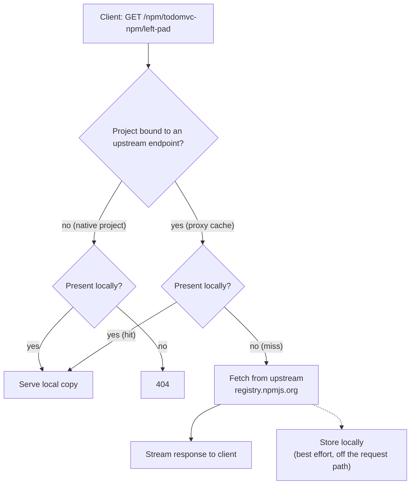

# Concepts: one registry, three artifact kinds

[← README](../README.md) · [Harbor setup →](02-harbor-setup.md)

This repository exists to demonstrate a single claim: one 8gcr/Harbor instance can
be the only artifact store a project needs. The TodoMVC apps are scaffolding. What
matters is that npm packages, Maven artifacts and container images all live in the
same registry, are all reached over the same hostname, and are all authenticated
the same way.

Three URL shapes, one instance:

| Artifact kind | Endpoint | Project used here |
|---|---|---|
| npm packages | `https://8gcr.container-registry.dev/npm/todomvc-npm/` | `todomvc-npm` |
| Maven artifacts | `https://8gcr.container-registry.dev/maven/todomvc-maven` | `todomvc-maven` |
| Container images | `https://8gcr.container-registry.dev/v2/` (the usual OCI path) | `todomvc` |

## Native hosting versus proxy cache

A Harbor project is one of two things with respect to a given package format.

**Native (hosted).** The project stores artifacts you pushed to it. Nothing else
is there. This is what a plain Harbor project has always been for container
images.

**Proxy cache.** The project is bound at creation time to a *registry endpoint*,
which is an upstream such as `registry.npmjs.org` or `repo1.maven.org/maven2`. A
request for something the project does not hold is fetched from that upstream,
streamed to the client, and stored locally so the next request is served without
leaving the instance.

The binding is the `registry_id` field on the project. A project created without
it is native only, and a project created with it is a proxy cache. See
[02-harbor-setup.md](02-harbor-setup.md) for the exact API calls.

## The precedence rule

For a proxy-cache project, a read is resolved in this order:

1. **Native storage is checked first.** If the project already holds the artifact,
   whether because it was previously cached or because somebody published it, that
   copy is served. Your own package always wins over an upstream package of the
   same name.
2. **On a miss, upstream is queried.** The response is streamed back to the client
   as it arrives, so the client does not wait for the whole caching cycle.
3. **Caching is best effort.** Storing the fetched artifact happens alongside the
   response. A failure to store does not fail the client request; it only means
   the next request is another miss.

Rule 1 is the one with consequences. It means a proxy-cache project is not merely
a read-through mirror; it is a namespace in which your own artifacts and upstream
artifacts coexist, and yours shadow theirs.

## Why `proxy_cache_allow_push` matters

By default a proxy-cache project is read-only to clients. Publishing into it is
refused, because the project's contents are supposed to be a faithful reflection
of upstream.

Setting `proxy_cache_allow_push=true` at creation time lifts that restriction. The
project keeps caching from upstream *and* accepts your pushes. That is what lets
`todomvc-npm` be the single value of `registry=` in `.npmrc`: the same URL resolves
`vue` from npmjs.org and `todomvc-todo-ui` from local storage. Without it you would
need two npm registries configured, a proxy for reads and a hosted one for writes,
and every consumer would need both.

The flag is **create-only**. Harbor does not accept it on an update, so a project
created without it has to be deleted and recreated. Decide before you create.

## Why container images need their own project

Container images do not go into `todomvc-npm` or `todomvc-maven`. They go into a
third, plain project, `todomvc`.

A project bound to a package-format registry endpoint is a package project, and
Harbor's package policy validation (`pkgpolicy.ValidateOCIPush`) rejects an OCI
manifest push into it. The reason is that the two content models do not mix
safely inside one namespace: an npm proxy-cache project derives its repository
names and version tags from the package format, and an OCI push would create
repositories in the same namespace under rules that format does not describe.

So the layout is: one project per package format that you proxy, plus one ordinary
project for images. All three sit on the same instance, under the same hostname,
behind the same credential.

## One credential for all three

Nothing in the pipeline stores a registry password. GitHub Actions mints an OIDC
JWT, and that JWT is used directly as the HTTP Basic password against all three
endpoints. There is no token-exchange step. See
[05-images-wif.md](05-images-wif.md) for how Harbor turns that JWT into a robot
account, and [06-pipeline.md](06-pipeline.md) for where it is used.

| Client | How the credential is supplied |
|---|---|
| npm | `_auth=<base64 of "user:password">` in `.npmrc`. `_authToken` does **not** work. |
| Maven | `<server>` entry in `settings.xml`, id matching the mirror and the deployment repository |
| Docker | `docker login -u jwt --password-stdin` |

In all three cases the username is ignored by Harbor when the password is a JWT.
This repository uses `jwt` by convention.

## Next

- [02-harbor-setup.md](02-harbor-setup.md): provisioning the endpoints, projects, IdP and robot
- [03-npm.md](03-npm.md): npm, from `npm ci` through `npm publish` and back
- [04-maven.md](04-maven.md): Maven, the same round trip
- [05-images-wif.md](05-images-wif.md): keyless image push and pull
- [06-pipeline.md](06-pipeline.md): the whole thing in CI
