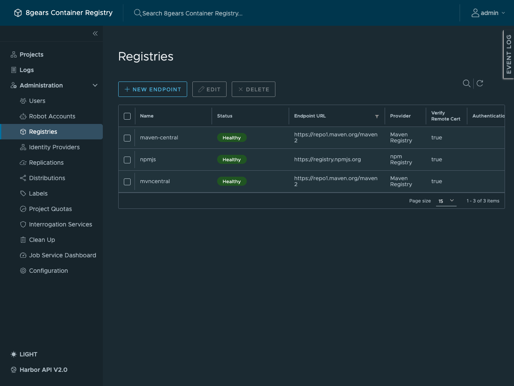
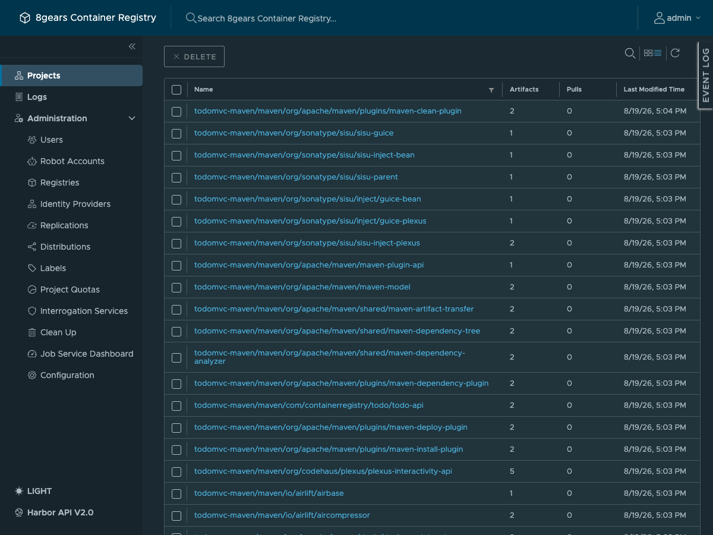

# Harbor setup

[← Concepts](01-concepts.md) · [npm →](03-npm.md)

Everything in this page is done through the Harbor API with `curl`. All of it is
also scripted, idempotently, in [`scripts/setup-8gcr.sh`](../scripts/setup-8gcr.sh):

```bash
HARBOR_URL=https://8gcr.container-registry.dev \
HARBOR_USER=admin HARBOR_PASS=... \
GITHUB_REPO=container-registry/harbor-multi-artifact-support-examples \
./scripts/setup-8gcr.sh
```

Read the script rather than trusting this page if the two ever disagree; the
script is what was run against the live instance.

Shared setup for the commands below:

```bash
export HARBOR_URL=https://8gcr.container-registry.dev
export API="$HARBOR_URL/api/v2.0"
export PASS=...                       # admin password
```

## 1. Registry endpoints

A registry endpoint is a named upstream. It is not itself reachable by clients;
it exists to be bound to a project.

```bash
curl -su "admin:$PASS" -H 'Content-Type: application/json' -X POST "$API/registries" \
  -d '{"name":"npmjs","type":"npm","url":"https://registry.npmjs.org","insecure":false}'

curl -su "admin:$PASS" -H 'Content-Type: application/json' -X POST "$API/registries" \
  -d '{"name":"maven-central","type":"maven","url":"https://repo1.maven.org/maven2","insecure":false}'
```

Both return `201`. Harbor health-checks them, and both report `healthy`.



The provider dropdown in **Administration → Registries → New Endpoint** may not
offer npm or Maven. That list comes from `GET /api/v2.0/replication/adapters`,
which is filtered by the `REPLICATION_ADAPTER_WHITELIST` environment variable on
core rather than by what the build supports, so on a deployment that has not been
given the package formats the same list also omits `quay`, `gitlab` and `dtr`.
`POST /registries` accepts the types either way, which is why this page uses the
API throughout.

Note the endpoint ids for the next step:

```bash
curl -su "admin:$PASS" "$API/registries" | python3 -c \
  'import sys,json;[print(r["id"], r["name"], r["type"]) for r in json.load(sys.stdin)]'
```

## 2. Projects

Three projects, two of them proxy caches bound to the endpoints above.

```bash
# npm proxy cache that also accepts pushes. Substitute the real registry id.
curl -su "admin:$PASS" -H 'Content-Type: application/json' -X POST "$API/projects" \
  -d '{"project_name":"todomvc-npm","registry_id":1,
       "metadata":{"public":"true","proxy_cache_allow_push":"true"}}'

# Maven, same shape.
curl -su "admin:$PASS" -H 'Content-Type: application/json' -X POST "$API/projects" \
  -d '{"project_name":"todomvc-maven","registry_id":2,
       "metadata":{"public":"true","proxy_cache_allow_push":"true"}}'

# Plain project for container images. No registry_id: this one is native only.
curl -su "admin:$PASS" -H 'Content-Type: application/json' -X POST "$API/projects" \
  -d '{"project_name":"todomvc","metadata":{"public":"true"}}'
```


The **Type** column distinguishes the two kinds. `todomvc-npm` and `todomvc-maven`
show as `Proxy Cache`; a project created without `registry_id`, like `todomvc` or
the built-in `library`, shows as `Project`.

### `proxy_cache_allow_push` is create-only

This flag can only be set in the `POST` that creates the project. Harbor will not
apply it through `PUT /api/v2.0/projects/<name>`. A project created without it
stays read-through forever, and the only remedy is to delete it and create it
again, which discards whatever is cached in it. Set it when you create the project
or accept that you will start over.

Why it is needed at all, and what the precedence between your packages and
upstream packages is, is explained in [01-concepts.md](01-concepts.md).

### What a populated proxy cache looks like

After a build has resolved dependencies through the project, its **Repositories**
tab lists everything that was pulled from upstream and everything that was
published locally, side by side.




Repository names carry the format as a path segment:
`todomvc-npm/npm/left-pad`, `todomvc-maven/maven/org/apache/commons/commons-lang3`.
That is how one project holds several package formats without their names
colliding.

## 3. Federated identity provider

This is what makes the pipeline secretless. Harbor is told to trust GitHub's OIDC
issuer.

```bash
curl -su "admin:$PASS" -H 'Content-Type: application/json' -X POST "$API/federated-idps" \
  -d '{"name":"github-actions",
       "description":"GitHub Actions OIDC - keyless pushes from CI",
       "openid_config_url":"https://token.actions.githubusercontent.com/.well-known/openid-configuration",
       "offline_validation":false}'
```

`offline_validation:false` means Harbor fetches the discovery document itself and
keeps the JWKS current. GitHub rotates its signing keys, and with online
validation that rotation needs no action here. Offline validation would require
you to paste and maintain the keys.

Both `openid_config_url` and `issuer` must be HTTPS; anything else is rejected with
`openid_config_url must use HTTPS protocol`. An issuer you run yourself in a lab
therefore has to go in as `offline_validation:true` with the keys supplied directly.

The IdP is visible under **Administration → Identity Providers**.

## 4. A robot account with no secret

An ordinary Harbor robot has a generated password that you have to store
somewhere. This one does not. It is bound to the IdP by `federatedidp_id`, and it
can only be assumed by presenting a valid token from that IdP.

```bash
IDP_ID=1   # from GET /api/v2.0/federated-idps

curl -su "admin:$PASS" -H 'Content-Type: application/json' -X POST "$API/robots" -d @- <<'JSON'
{
  "name": "todomvc-ci",
  "description": "Keyless CI robot (GitHub Actions WIF)",
  "level": "system",
  "duration": -1,
  "federatedidp_id": 1,
  "permissions": [
    {"kind":"project","namespace":"todomvc",
     "access":[{"resource":"repository","action":"push"},
               {"resource":"repository","action":"pull"},
               {"resource":"artifact","action":"read"},
               {"resource":"tag","action":"create"}]},
    {"kind":"project","namespace":"todomvc-npm",
     "access":[{"resource":"repository","action":"push"},
               {"resource":"repository","action":"pull"},
               {"resource":"artifact","action":"read"},
               {"resource":"tag","action":"create"}]},
    {"kind":"project","namespace":"todomvc-maven",
     "access":[{"resource":"repository","action":"push"},
               {"resource":"repository","action":"pull"},
               {"resource":"artifact","action":"read"},
               {"resource":"tag","action":"create"}]}
  ]
}
JSON
```

`duration: -1` means non-expiring. That is safe here precisely because there is no
secret to leak: the robot is unusable without a fresh, correctly-claimed token.

A permission entry naming a project that does not exist is rejected, so create the
projects first. The setup script checks which of the three projects exist and
grants on that set, then **reconciles the robot with a `PUT` on every run**.

The reconcile matters more than it looks. If the npm and Maven projects could not
be created on the first run, the robot is created with `todomvc` alone. On a later
run, once those projects exist, `POST /robots` returns 409 for the name that is
already taken, so a script that stopped there would leave the robot permanently
short of push on the package projects, and the pipeline would fail with a 401
against projects that visibly exist.

One quirk when reconciling: the update has to carry the robot's **stored** name.
Harbor prefixes system robots with the configured `robot_name_prefix`, `robot$` by
default, so sending back the name you asked for at creation time is rejected with
`cannot update the level or name of robot`.

That prefix is also what you have to look the robot up by, and guessing it wrong
finds nothing. Read it from `GET /api/v2.0/configurations`, as the script does,
rather than assuming the default.

## 5. Claim rules

Claim rules are what actually connect a token to a robot. Without them the IdP is
trusted but no token maps to anything.

```bash
IDP_ID=1
ROBOT_ID=3     # from GET /api/v2.0/robots

# Provider-wide rule: robot_id 0 means "applies to every token from this IdP".
# Any token whose aud is not the registry hostname is rejected outright.
curl -su "admin:$PASS" -H 'Content-Type: application/json' \
  -X POST "$API/federated-idps/$IDP_ID/claims" \
  -d "{\"rules\":[{\"identity_provider_id\":$IDP_ID,\"robot_id\":0,
        \"claim_path\":\"aud\",\"value\":\"8gcr.container-registry.dev\"}]}"

# Robot-bound rule: this is the one that selects the robot.
curl -su "admin:$PASS" -H 'Content-Type: application/json' \
  -X POST "$API/federated-idps/$IDP_ID/claims" \
  -d "{\"rules\":[{\"identity_provider_id\":$IDP_ID,\"robot_id\":$ROBOT_ID,
        \"claim_path\":\"repository\",
        \"value\":\"container-registry/harbor-multi-artifact-support-examples\"}]}"
```

The two rules do different jobs:

- `robot_id: 0` is a **gate**. It applies to every token from this provider and
  must pass before anything else is considered.
- `robot_id: <id>` is a **selector**. A token that satisfies it becomes that
  robot and gets that robot's permissions.

Using the registry hostname as the audience is deliberate. GitHub will mint a
token with whatever `aud` the workflow asks for, so a token minted for some other
service cannot be replayed against this registry, and vice versa. The script takes
it from `HARBOR_URL`'s host, port included, so an instance on a non-default port
gets an audience like `registry.example.com:8180` and the workflow has to ask for
exactly that string. The pipeline requests exactly this audience; see
[`.github/actions/8gcr-token/action.yml`](../.github/actions/8gcr-token/action.yml).

The `repository` claim is GitHub's `owner/repo`. Tokens from any other repository
satisfy the provider gate but match no robot, so they authenticate as nobody. To
narrow further, add a rule on `ref` (`refs/heads/main`) or `environment`.

## 6. Check it

JSON or XML, not HTML, is the success signal. The portal answers `200 text/html`
for any path it does not recognise, so a path that lands on it looks like a
success to `curl -f` and like a parse error to npm.

```console
$ curl -su "admin:$PASS" "$HARBOR_URL/npm/todomvc-npm/-/whoami"
{"username":"admin"}

$ curl -s "$HARBOR_URL/maven/todomvc-maven/org/apache/commons/commons-lang3/maven-metadata.xml"
<?xml version="1.0" encoding="UTF-8"?>
<metadata>
  <groupId>org.apache.commons</groupId>
  <artifactId>commons-lang3</artifactId>
  ...

$ curl -so /dev/null -w '%{http_code}\n' "$HARBOR_URL/v2/"
401
```

`401` from `/v2/` is correct: that is the OCI distribution API asking for a
token, which is what `docker login` answers. The Maven check deliberately asks for
an upstream coordinate rather than one of your own: nothing has been published yet
at this point, and an empty project answers `404` for its own artifacts while the
proxy cache is working perfectly.

The equivalent check the pipeline runs before it publishes anything is in
[06-pipeline.md](06-pipeline.md#preflight).

## Next

- [03-npm.md](03-npm.md)
- [04-maven.md](04-maven.md)
- [05-images-wif.md](05-images-wif.md)
