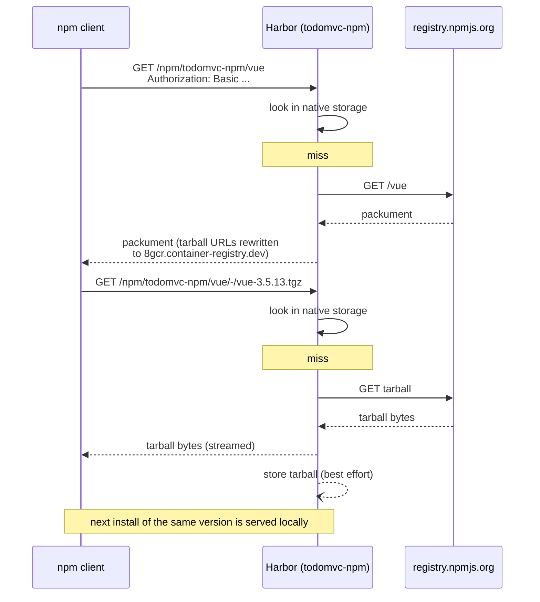

# npm

[← Harbor setup](02-harbor-setup.md) · [Maven →](04-maven.md)

One npm registry URL does both jobs: it resolves `vue` and `vite` from
npmjs.org through the proxy cache, and it resolves `todomvc-todo-ui`, which this
repository publishes, from local storage. That is what
`proxy_cache_allow_push=true` on the `todomvc-npm` project buys; see
[01-concepts.md](01-concepts.md).

> `/npm/` is not currently routed to core on `8gcr.container-registry.dev`, so
> these commands return the portal's HTML instead of JSON there. The symptom and
> the fix are in [00-environment.md](00-environment.md). Everything below was
> exercised against a deployment where the route is present.

## Point npm at the project

[`apps/todo-ui/.npmrc`](../apps/todo-ui/.npmrc):

```ini
registry=https://8gcr.container-registry.dev/npm/todomvc-npm/
always-auth=true
```

The `_auth` key below has to name this same URL, trailing slash included, since
npm attaches credentials by URI prefix. `always-auth=true` makes npm send them on
tarball downloads too, not only on metadata requests.

`package.json` pins the publish target separately, so a stray global registry
setting cannot redirect a publish:

```json
"publishConfig": {
  "registry": "https://8gcr.container-registry.dev/npm/todomvc-npm/"
}
```

## Authenticate

Harbor accepts **HTTP Basic** on the npm endpoint. In `.npmrc` that is the `_auth`
key, which holds `base64("username:password")`:

```bash
auth="$(printf 'jwt:%s' "$HARBOR_PASSWORD" | base64 -w0)"
echo "//8gcr.container-registry.dev/npm/todomvc-npm/:_auth=$auth" >> .npmrc
```

Two things to know:

- **`_authToken` does not work.** It sends `Authorization: Bearer <token>`, which
  the npm handler rejects. The portal's **Usage** tab for an npm repository emits
  an `_authToken` line; that snippet is wrong and produces a 401. Use `_auth`.
- **The username is ignored** when the password is an OIDC JWT. This repository
  writes `jwt` for legibility. With a conventional Harbor robot you would use the
  robot's own name and secret here, still through `_auth`.

`npm login` appears to succeed against the endpoint but stores an `_authToken`,
so it leaves you unauthenticated in practice. Write the `_auth` line yourself.

## Install: the proxy path

```bash
cd apps/todo-ui
npm ci
```

Every request goes to `https://8gcr.container-registry.dev/npm/todomvc-npm/`.
On a miss, Harbor fetches from npmjs.org, streams the response back, and stores
it.



Tarball URLs in the packument are rewritten to the instance's external URL, so
the client never contacts npmjs.org directly. That is the whole point: one
egress path, one audit trail, one credential.

`package-lock.json` in this repository was generated against npmjs.org, so its
`resolved` fields name `registry.npmjs.org`. npm rewrites the host of a
default-registry `resolved` URL to whatever registry is configured, so `npm ci`
under this `.npmrc` still fetches through Harbor.

## Publish: the native path

```bash
npm version 0.1.7 --no-git-tag-version
npm publish
```

The package lands in the same project it resolves from, as
`todomvc-npm/npm/todomvc-todo-ui`.

### Version immutability

Published versions are immutable, and Harbor enforces that with a useful nuance:

| Republish of an existing version | Result |
|---|---|
| identical payload | succeeds, idempotently |
| changed payload | `409 Conflict - immutable: version X already exists with different payload` |

The first case is what makes a rerun of a CI job safe. The second is what stops
a version's contents from changing under consumers who already resolved it. Treat
the 409 as correct behaviour, not as an obstacle: bump the version. The pipeline
versions by `github.run_number` for exactly this reason
([06-pipeline.md](06-pipeline.md)).

## Pull it back

Publishing that is never read back proves nothing. From a clean directory with a
cold cache:

```bash
dir="$(mktemp -d)" && cd "$dir"
cat > .npmrc <<EOF
registry=https://8gcr.container-registry.dev/npm/todomvc-npm/
always-auth=true
//8gcr.container-registry.dev/npm/todomvc-npm/:_auth=$auth
EOF

npm view todomvc-todo-ui@0.1.7
npm pack todomvc-todo-ui@0.1.7
```

This round trip, publish then `npm view` then `npm pack` from a cold cache, was
verified working.

## Known issue: incomplete packuments through the proxy cache

This is a real defect, currently open. It affects reads of **upstream** packages
through an npm proxy-cache project. It does not affect packages you publish
yourself.

**Symptom.** The packument that Harbor renders lists fewer versions than Harbor
actually stores, and it advertises a `dist-tags.latest` that is not among the
versions it lists. `npm install` then fails to resolve ranges that should
resolve, with `ETARGET / No matching version found`. Retrying does not fix it.

**Observed reproduction**, against `left-pad`:

```console
# 1. Package never fetched before. This response is correct.
$ curl -s https://8gcr.container-registry.dev/npm/todomvc-npm/left-pad \
    | python3 -c 'import sys,json;d=json.load(sys.stdin);print(len(d["versions"]),d["dist-tags"])'
15 {'latest': '1.3.0'}          # 1.3.0 is present in versions

# 2. Install a specific older version.
$ npm install left-pad@1.1.0
npm error notarget No matching version found for left-pad@1.1.0.

# 3. Ask for the packument again. It has shrunk.
$ curl -s https://8gcr.container-registry.dev/npm/todomvc-npm/left-pad \
    | python3 -c 'import sys,json;d=json.load(sys.stdin);print(list(d["versions"]),d["dist-tags"])'
['0.0.2', '0.0.3', '0.0.4'] {'latest': '1.3.0'}   # latest is not in the list

# 4. Consequence.
$ npm view left-pad@latest
npm error 404 Not Found - GET .../left-pad/1.3.0

# 5. But Harbor has all 15 versions stored.
$ curl -su "admin:$PASS" \
    "https://8gcr.container-registry.dev/api/v2.0/projects/todomvc-npm/repositories/npm%2Fleft-pad/artifacts" \
    | python3 -c 'import sys,json;print([t["name"] for a in json.load(sys.stdin) for t in a["tags"]])'
['0.0.0', '0.0.1', ..., '1.3.0']
```

Step 5 is the important one. The data is present in the registry. The packument
rendering is what is wrong.

The same measurement on other packages, comparing what Harbor lists against what
upstream actually publishes:

| Package | Versions listed by Harbor | Versions upstream |
|---|---|---|
| `fdir` | 17 | 45 |
| `postcss` | 30 | 290 |
| `vue` | 37 | 587 |
| `lodash` | 16 | 117 |
| `vite` | 33 | 748 |

In every one of these, `dist-tags.latest` was absent from `versions`.

**Practical impact.** Installing a normal dependency tree through an npm
proxy-cache project is not currently reliable. Any range that happens to need a
version outside the truncated list fails, and which versions survive depends on
what has been fetched.

**What still works.** Publishing your own packages into the project, resolving
them by exact version, and pulling them back. The npm parts of
[the pipeline](06-pipeline.md) that matter to this demo are unaffected.

**Workaround while it is open.** Resolve third-party dependencies from npmjs.org
and use the Harbor project for your own packages:

```bash
npm ci --registry=https://registry.npmjs.org
```

## Next

- [04-maven.md](04-maven.md)
- [05-images-wif.md](05-images-wif.md)
