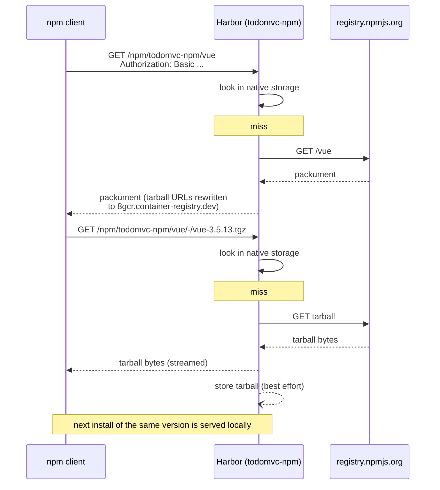

# npm

[← Harbor setup](02-harbor-setup.md) · [Maven →](04-maven.md)

One npm registry URL does both jobs: it resolves `vue` and `vite` from
npmjs.org through the proxy cache, and it resolves `todomvc-todo-ui`, which this
repository publishes, from local storage. That is what
`proxy_cache_allow_push=true` on the `todomvc-npm` project buys; see
[01-concepts.md](01-concepts.md).

## Point npm at the project

[`apps/todo-ui/.npmrc`](../apps/todo-ui/.npmrc):

```ini
registry=https://8gcr.container-registry.dev/npm/todomvc-npm/
always-auth=true
```

The `_auth` key below has to name this same URL, trailing slash included, since
npm attaches credentials by URI prefix. `always-auth=true` makes npm send them on
tarball downloads too, not only on metadata requests.

`package.json` pins the publish target separately, so a stray global registry
setting cannot redirect a publish:

```json
"publishConfig": {
  "registry": "https://8gcr.container-registry.dev/npm/todomvc-npm/"
}
```

## Authenticate

Harbor accepts **HTTP Basic** on the npm endpoint. In `.npmrc` that is the `_auth`
key, which holds `base64("username:password")`:

```bash
# base64 -w0 is GNU-only; macOS needs -b0. Piping through tr works on both.
auth="$(printf 'jwt:%s' "$HARBOR_PASSWORD" | base64 | tr -d '\n')"
echo "//8gcr.container-registry.dev/npm/todomvc-npm/:_auth=$auth" >> .npmrc
```

Two things to know:

- **`_authToken` does not work.** It sends `Authorization: Bearer <token>`, which
  the npm endpoint rejects. The portal's **Usage** tab for an npm repository emits
  an `_authToken` line; that snippet is wrong. Use `_auth`.

  Watch out for a misleading result here. On a **public** project, reads succeed
  anonymously, so an `_authToken` line looks like it works right up until you
  publish. Against an endpoint that actually requires credentials the difference
  is plain:

  ```console
  $ curl -sH "Authorization: Bearer $B64" .../npm/todomvc-npm/-/whoami
  {"error":"unauthorized"}
  $ curl -sH "Authorization: Basic $B64" .../npm/todomvc-npm/-/whoami
  {"username":"admin"}
  ```

- **The username is ignored** when the password is an OIDC JWT. This repository
  writes `jwt` for legibility. With a conventional Harbor robot you would use the
  robot's own name and secret here, still through `_auth`.

**`npm login` does not work at all**, so do not reach for it. The modern endpoint
is absent and npm's legacy fallback is treated as a push:

```console
$ curl -s .../npm/todomvc-npm/-/v1/login
{"error":"web login not supported, use Basic auth (.npmrc _auth)"}
$ curl -sX PUT .../npm/todomvc-npm/-/user/org.couchdb.user:admin -d '{...}'
{"errors":[{"code":"UNAUTHORIZED","message":"unauthorized to push project todomvc-npm: unauthorized to push project todomvc-npm"}]}
```

No token is ever issued. Write the `_auth` line yourself.

## Install: the proxy path

```bash
cd apps/todo-ui
npm ci
```

Every request goes to `https://8gcr.container-registry.dev/npm/todomvc-npm/`.
On a miss, Harbor fetches from npmjs.org, streams the response back, and stores
it.



Tarball URLs in the packument are rewritten to the instance's external URL, so
the client never contacts npmjs.org directly. That is the whole point: one
egress path, one audit trail, one credential.

`package-lock.json` in this repository was generated against npmjs.org, so its
`resolved` fields name `registry.npmjs.org`. npm rewrites the host of a
default-registry `resolved` URL to whatever registry is configured, so `npm ci`
under this `.npmrc` still fetches through Harbor.

## Publish: the native path

```console
$ npm version 0.1.100 --no-git-tag-version
$ npm publish
npm notice Publishing to https://8gcr.container-registry.dev/npm/todomvc-npm/
+ todomvc-todo-ui@0.1.100
```

The package lands in the same project it resolves from, as
`todomvc-npm/npm/todomvc-todo-ui`.

### Version immutability

Published versions are immutable, and Harbor enforces that with a useful nuance:

| Republish of an existing version | Result |
|---|---|
| identical payload | succeeds, idempotently |
| changed payload | `409 Conflict - immutable: version X already exists with different payload` |

The first case is what makes a rerun of a CI job safe. The second is what stops
a version's contents from changing under consumers who already resolved it. Treat
the 409 as correct behaviour, not as an obstacle: bump the version. The pipeline
versions by `github.run_number` for exactly this reason
([06-pipeline.md](06-pipeline.md)).

## Pull it back

Publishing that is never read back proves nothing. From a clean directory with a
cold cache:

```console
$ dir="$(mktemp -d)" && cd "$dir"
$ cat > .npmrc <<EOF
registry=https://8gcr.container-registry.dev/npm/todomvc-npm/
always-auth=true
//8gcr.container-registry.dev/npm/todomvc-npm/:_auth=$auth
EOF

$ npm view todomvc-todo-ui@0.1.100 --cache "$dir/.cache"
todomvc-todo-ui@0.1.100 | MIT | deps: 3 | versions: 2
.tarball: https://8gcr.container-registry.dev/npm/todomvc-npm/todomvc-todo-ui/-/todomvc-todo-ui-0.1.100.tgz
.shasum: 8944703367f7a243860c4c532a384279a3ade303

$ npm pack todomvc-todo-ui@0.1.100 --cache "$dir/.cache"
todomvc-todo-ui-0.1.100.tgz
```

`--cache` pointing at a fresh directory is what makes this prove something.
Without it npm can answer from `~/.npm` and never touch the registry. Note the
tarball URL: it names the registry, not npmjs.org.

## Where the proxy cache is still rough: partial packuments

Everything above works. This is the one place where the proxy cache does not yet
behave like npmjs.org, and it is worth knowing before you point a real build at
it. It affects reads of **upstream** packages only, never the packages you
publish yourself.

**Symptom.** For some upstream packages the packument Harbor renders lists fewer
versions than npmjs.org publishes. `dist-tags.latest` is always reported, and it
is always the true upstream latest, but the version it names is not always among
the versions listed.

Measured against the live instance at 2026-08-19T10:40Z, comparing what Harbor
lists, what upstream publishes, and what the project has actually stored:

| Package | Listed by Harbor | Published upstream | Stored in the project | `latest` also listed |
|---|---|---|---|---|
| `left-pad` | 15 | 15 | 15 | yes |
| `postcss` | 256 | 290 | 258 | yes |
| `vue` | 238 | 587 | 3 | yes |
| `fdir` | 6 | 45 | 7 | no |
| `lodash` | 6 | 117 | 6 | no |
| `vite` | 4 | 748 | 4 | no |

For five of the six, what Harbor lists is close to what the project has cached
rather than to what npmjs.org publishes. `lodash` is the clean case, six listed
against six stored:

```console
$ curl -s .../npm/todomvc-npm/lodash | jq -c '.versions|keys'
["0.4.1","1.2.1","4.14.0","4.15.0","4.2.0","4.4.0"]
```

Those six are the versions somebody happened to install through this project,
and `left-pad` reads as complete only because all fifteen of its versions have
been pulled through at some point. `vue` is the case that stops the explanation
there: 238 listed against 3 stored. So the cache is where most of the shortfall
comes from, but it is not the whole mechanism, and this is a measurement from
outside rather than a diagnosis.

The counts also move as the cache fills. Take the table as a snapshot, not a
constant.

**What this costs you.** A range resolves against whatever is listed; an exact
pin of a version that is not listed fails:

```console
$ npm install vue@3.5.13
npm error code ETARGET
npm error notarget No matching version found for vue@3.5.13.

$ npm install vue@^3.5.13
added 23 packages in 4s          # resolved 3.5.41, which is listed

$ npm install lodash@4.17.21
npm error code ETARGET
npm error notarget No matching version found for lodash@4.17.21.
```

That last one is the case to watch: `4.17.21` is the version most lockfiles in
the world name, and it is absent from the listing even though upstream has it.

**What works regardless.** `npm ci` against this repository's own lockfile
completes through the proxy, because every version it pins is one the project has
already surfaced:

```console
$ cd apps/todo-ui && npm ci
added 36 packages in 5s
```

Publishing your own packages, resolving them by exact version, and pulling them
back are all unaffected: `todomvc-todo-ui` lists exactly the versions the
registry stores.

**If you need a cold lockfile to install today**, resolve third-party
dependencies from npmjs.org and keep the Harbor project for your own packages:

```bash
npm ci --registry=https://registry.npmjs.org
```

## Next

- [04-maven.md](04-maven.md)
- [05-images-wif.md](05-images-wif.md)
