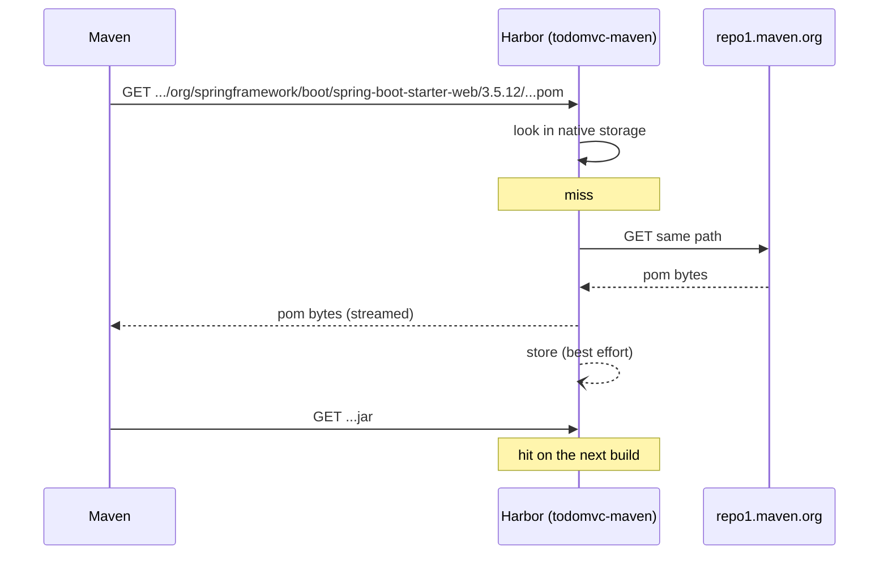

# Maven

[← npm](03-npm.md) · [Images and WIF →](05-images-wif.md)

Same shape as npm: one URL that both proxies Maven Central and hosts the jar this
repository publishes.

```
https://8gcr.container-registry.dev/maven/todomvc-maven
```

No trailing slash, and no `/repository/` or `/releases/` suffix. The project name
is the last segment.

> `/maven/` is not currently routed to core on `8gcr.container-registry.dev`.
> See [00-environment.md](00-environment.md). The commands below were exercised
> against a deployment where the route is present.

## The client configuration

[`apps/todo-api/.mvn/settings.xml`](../apps/todo-api/.mvn/settings.xml):

```xml
<mirrors>
  <mirror>
    <id>8gcr</id>
    <name>8gcr Maven proxy cache</name>
    <mirrorOf>*</mirrorOf>
    <url>https://8gcr.container-registry.dev/maven/todomvc-maven</url>
  </mirror>
</mirrors>

<servers>
  <server>
    <id>8gcr</id>
    <username>${env.HARBOR_USERNAME}</username>
    <password>${env.HARBOR_PASSWORD}</password>
  </server>
</servers>
```

Run it with `-s`:

```bash
cd apps/todo-api
export HARBOR_USERNAME=jwt
export HARBOR_PASSWORD=...          # the OIDC JWT, or a robot secret
mvn -B -s .mvn/settings.xml verify
```

### Why `mirrorOf=*` and not a `<repositories>` block

The obvious move is to add a `<repositories>` entry to `pom.xml` pointing at
Harbor. It is not enough. A `<repositories>` block redirects **dependency**
resolution only. Maven resolves **plugins** and their transitive dependencies
from `<pluginRepositories>`, which defaults to the built-in `central` plugin
repository, and that default is untouched by a `<repositories>` block. The build
would pull `maven-compiler-plugin`, `maven-surefire-plugin` and the Spring Boot
plugin straight from Maven Central while claiming to go through the registry.

A mirror with `mirrorOf=*` intercepts every repository, declared or built-in,
dependency or plugin. It is the only single place that catches both. That is why
[`pom.xml`](../apps/todo-api/pom.xml) has no `<repositories>` block at all, on
purpose.

`mirrorOf=central` would be the narrower alternative; it still misses any
repository a dependency's own pom declares.

### Why the ids have to match

`8gcr` appears three times, and all three must be the same string:

| Where | What it does |
|---|---|
| `<mirror><id>` in settings.xml | names the mirror |
| `<server><id>` in settings.xml | attaches credentials to whatever has that id |
| `<distributionManagement><repository><id>` in pom.xml | names the deployment target |

Maven attaches credentials by id, not by URL. One `<server>` entry therefore
authenticates both the reads through the mirror and the writes to
`distributionManagement`. If the ids drift apart, reads become anonymous, or the
deploy fails with a 401 that names a repository you thought you had configured.

## Resolving through the proxy

> **Known issue: the Maven proxy cache could not be reproduced from a clean
> instance.** See [below](#known-issue-cold-proxy-fetches-return-404) before you
> rely on this. Everything else on this page (client configuration, publishing,
> resolving your own artifacts) is unaffected.

When it works, `mvn verify` pulls the entire Spring Boot dependency tree through
the project and artifacts come back byte-identical to upstream. For example,
`spring-boot-dependencies-3.5.12.pom` is 97521 bytes both from Maven Central and
through `todomvc-maven`, and Maven logs the fetch as
`Downloaded from 8gcr: .../spring-boot-starter-parent-3.5.12.pom (13 kB at 92 kB/s)`.



### Known issue: cold proxy fetches return 404

On a freshly created instance, every **uncached** Maven path returns a bare
`404 page not found` (Go's default handler, 19 bytes). Nothing is stored, and
core logs no upstream attempt even at `LOG_LEVEL=debug`: the request reaches the
route and is authenticated, then ends.

```console
$ curl -H "Authorization: Basic $B64" .../maven/mvn1/junit/junit/4.13.2/junit-4.13.2.pom
404 page not found
$ curl https://repo1.maven.org/maven2/junit/junit/4.13.2/junit-4.13.2.pom -o /dev/null -w '%{http_code}'
200
```

Checked and ruled out:

- the upstream endpoint reports `status: healthy`, and the project's
  `registry_id` is bound correctly
- Maven Central is reachable from inside the core container's network (200)
- four upstream URL spellings (`/maven2`, `/maven2/`, the bare host, and
  `repo.maven.apache.org`)
- both `curl` and the real `mvn` client
- repeated requests, in case the cache fill were asynchronous
- a full teardown with fresh volumes
- waiting out the 5 minute registry health-check interval

The npm proxy cache on the **same instance, same moment** fetches fine, so this
is specific to the Maven path rather than to proxying in general.

Two honest caveats. Earlier in the same lab session Maven proxying did work:
36 Maven repositories were populated by a real `mvn` run and a 97 KB POM came
back byte-exact through Harbor. That state was destroyed by a `docker compose
down -v` during this investigation, so it could not be inspected afterwards.
And this was observed on a local Compose deployment, not on
`8gcr.container-registry.dev`, where `/maven/` is not routed to core at all
(see [00-environment.md](00-environment.md)).

So: treat Maven proxy caching as unverified. Publishing to and resolving from
the registry, covered below, worked consistently.

### The checksum warning

Maven prints this for proxied files:

```
[WARNING] Checksum validation failed, no checksums available from 8gcr for ...
```

It is a warning, not an error, and the build succeeds. Harbor is not serving the
`.sha1` and `.md5` sidecar files that Maven Central publishes alongside each
artifact, so Maven has nothing to compare against and says so. Expect to see many
of these lines on a cold cache. They are noise, not a failure.

Do not reach for `-C` (`--strict-checksums`) to tidy this up. It turns the same
condition into a build failure. The default checksum policy, `warn`, is the one
you want against this proxy.

## Publishing

```bash
mvn -B -s .mvn/settings.xml versions:set -DnewVersion=0.1.7 -DgenerateBackupPoms=false
mvn -B -s .mvn/settings.xml deploy -DskipTests
```

`distributionManagement` in [`pom.xml`](../apps/todo-api/pom.xml) points back at
the same project:

```xml
<distributionManagement>
  <repository>
    <id>8gcr</id>
    <name>8gcr Maven</name>
    <url>https://${harbor.registry}/maven/${harbor.maven.project}</url>
  </repository>
</distributionManagement>
```

The artifact appears as `todomvc-maven/maven/com/containerregistry/todo/todo-api`.

### What Harbor does with metadata and checksums

Two behaviours differ from a plain file-server repository, and both are
deliberate:

- **`maven-metadata.xml` is synthesized.** Harbor generates the version index from
  the artifacts it actually holds, rather than storing and serving whatever
  `maven-metadata.xml` a client uploaded. A stale or hand-edited metadata file
  therefore cannot desynchronize the repository from its contents.
- **Checksums are derived, not trusted.** Harbor computes the digest of the bytes
  it received instead of accepting the `.sha1` a client uploaded alongside them.
  An uploaded checksum that disagrees with the payload cannot be served back.

Release versions are immutable. Redeploying the same version is a conflict, which
is why the pipeline sets the version from `github.run_number` before deploying.

## Pull it back

Force a cold local repository so that a hit proves the artifact travelled over the
network:

```bash
mvn -B -s apps/todo-api/.mvn/settings.xml \
  -Dmaven.repo.local="$(mktemp -d)" \
  dependency:get \
  -Dartifact=com.containerregistry.todo:todo-api:0.1.7
```

`-Dmaven.repo.local` pointing at a fresh temp directory is the part that matters.
Without it, `dependency:get` can be satisfied from `~/.m2` and prove nothing.

## Next

- [05-images-wif.md](05-images-wif.md)
- [06-pipeline.md](06-pipeline.md)
