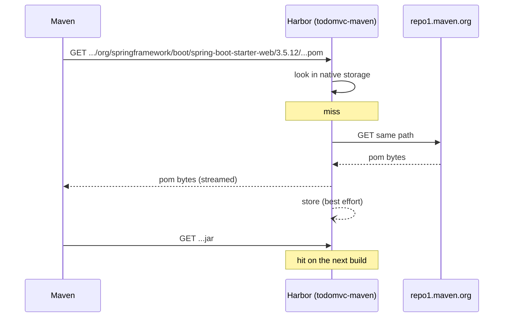

# Maven

[← npm](03-npm.md) · [Images and WIF →](05-images-wif.md)

Same shape as npm: one URL that both proxies Maven Central and hosts the jar this
repository publishes.

```
https://8gcr.container-registry.dev/maven/todomvc-maven
```

No trailing slash, and no `/repository/` or `/releases/` suffix. The project name
is the last segment.

## The client configuration

[`apps/todo-api/.mvn/settings.xml`](../apps/todo-api/.mvn/settings.xml):

```xml
<mirrors>
  <mirror>
    <id>8gcr</id>
    <name>8gcr Maven proxy cache</name>
    <mirrorOf>*</mirrorOf>
    <url>https://8gcr.container-registry.dev/maven/todomvc-maven</url>
  </mirror>
</mirrors>

<servers>
  <server>
    <id>8gcr</id>
    <username>${env.HARBOR_USERNAME}</username>
    <password>${env.HARBOR_PASSWORD}</password>
  </server>
</servers>
```

Run it with `-s`:

```bash
cd apps/todo-api
export HARBOR_USERNAME=jwt
export HARBOR_PASSWORD=...          # the OIDC JWT, or a robot secret
mvn -B -s .mvn/settings.xml verify
```

### Why `mirrorOf=*` and not a `<repositories>` block

The obvious move is to add a `<repositories>` entry to `pom.xml` pointing at
Harbor. It is not enough. A `<repositories>` block redirects **dependency**
resolution only. Maven resolves **plugins** and their transitive dependencies
from `<pluginRepositories>`, which defaults to the built-in `central` plugin
repository, and that default is untouched by a `<repositories>` block. The build
would pull `maven-compiler-plugin`, `maven-surefire-plugin` and the Spring Boot
plugin straight from Maven Central while claiming to go through the registry.

A mirror with `mirrorOf=*` intercepts every repository, declared or built-in,
dependency or plugin. It is the only single place that catches both. That is why
[`pom.xml`](../apps/todo-api/pom.xml) has no `<repositories>` block at all, on
purpose.

`mirrorOf=central` would be the narrower alternative; it still misses any
repository a dependency's own pom declares.

### Why the ids have to match

`8gcr` appears three times, and all three must be the same string:

| Where | What it does |
|---|---|
| `<mirror><id>` in settings.xml | names the mirror |
| `<server><id>` in settings.xml | attaches credentials to whatever has that id |
| `<distributionManagement><repository><id>` in pom.xml | names the deployment target |

Maven attaches credentials by id, not by URL. One `<server>` entry therefore
authenticates both the reads through the mirror and the writes to
`distributionManagement`. If the ids drift apart, reads become anonymous, or the
deploy fails with a 401 that names a repository you thought you had configured.

## Publishing

```console
$ mvn -B -s .mvn/settings.xml versions:set -DnewVersion=0.1.102 -DgenerateBackupPoms=false
$ mvn -B -s .mvn/settings.xml deploy -DskipTests
[INFO] Uploading to 8gcr: .../com/containerregistry/todo/todo-api/0.1.102/todo-api-0.1.102.jar
[INFO] Uploaded to 8gcr:  .../todo-api-0.1.102.jar (54 MB at 16 MB/s)
[INFO] Uploading to 8gcr: .../todo-api-0.1.102.pom
[INFO] Downloading from 8gcr: .../com/containerregistry/todo/todo-api/maven-metadata.xml
[INFO] Uploading to 8gcr:   .../com/containerregistry/todo/todo-api/maven-metadata.xml
[INFO] BUILD SUCCESS
```

`distributionManagement` in [`pom.xml`](../apps/todo-api/pom.xml) points back at
the same project:

```xml
<distributionManagement>
  <repository>
    <id>8gcr</id>
    <name>8gcr Maven</name>
    <url>https://${harbor.registry}/maven/${harbor.maven.project}</url>
  </repository>
</distributionManagement>
```

The artifact appears as `todomvc-maven/maven/com/containerregistry/todo/todo-api`.

### What Harbor does with metadata and checksums

Two behaviours differ from a plain file-server repository, and both are
deliberate.

**`maven-metadata.xml` is synthesized.** Maven uploads one during `deploy`;
Harbor discards it and generates the version index from the artifacts it actually
holds. A stale or hand-edited metadata file therefore cannot desynchronize the
repository from its contents.

```console
$ curl -s .../maven/todomvc-maven/com/containerregistry/todo/todo-api/maven-metadata.xml
<?xml version="1.0" encoding="UTF-8"?>
<metadata>
  <groupId>com.containerregistry.todo</groupId>
  <artifactId>todo-api</artifactId>
  <versioning>
    <latest>0.1.102</latest>
    <release>0.1.102</release>
    <versions>
      <version>0.1.101</version>
      <version>0.1.102</version>
    </versions>
    <lastUpdated>20260819102316</lastUpdated>
  </versioning>
</metadata>
```

**Checksums are derived, not trusted.** Maven `PUT`s a `.sha1` and a `.md5`
beside each file. Harbor accepts and discards them, and computes the digest of
the bytes it received when one is requested, so an uploaded checksum that
disagrees with its payload cannot be served back:

```console
$ curl -s .../todo-api/0.1.0-verify1/todo-api-0.1.0-verify1.pom.sha1
277fa34694c431975f3d9e540df8f4f54c4d3a93
$ curl -s .../todo-api/0.1.0-verify1/todo-api-0.1.0-verify1.pom | shasum -a 1
277fa34694c431975f3d9e540df8f4f54c4d3a93  -
```

The same holds for files that arrived through the proxy cache rather than from a
`deploy`: `commons-io-2.6.pom` and `slf4j-api-2.0.13.jar` both serve a `.sha1`
that matches their bytes. Maven validates these on download and a cold resolve
through the mirror prints no checksum warnings, so the default checksum policy
(`warn`) needs no adjusting here and `-C` / `--strict-checksums` is not something
you have to work around.

### Version immutability

Release versions are immutable, with the same nuance as npm:

| Redeploy of an existing version | Result |
|---|---|
| identical payload | succeeds, idempotently |
| changed payload | `status code: 409, reason phrase: Conflict` |

The first case makes a rerun of a CI job safe. The second is why the pipeline
sets the version from `github.run_number` before deploying. The check is per file,
not per deploy: a rebuilt jar at an existing version 409s while the unchanged
`.pom` beside it uploads successfully in the same run.

## Pull it back

Force a cold local repository so that a hit proves the artifact travelled over the
network:

```bash
mvn -B -s apps/todo-api/.mvn/settings-upstream.xml \
  -Dmaven.repo.local="$(mktemp -d)" \
  dependency:get \
  -DremoteRepositories="8gcr::::https://8gcr.container-registry.dev/maven/todomvc-maven" \
  -Dartifact=com.containerregistry.todo:todo-api:0.1.102
```

```console
[INFO] Downloaded from 8gcr: .../com/containerregistry/todo/todo-api/0.1.102/todo-api-0.1.102.jar (54 MB)
[INFO] BUILD SUCCESS
```

`-Dmaven.repo.local` pointing at a fresh temp directory is the part that matters.
Without it, `dependency:get` can be satisfied from `~/.m2` and prove nothing.

The mirror-less settings are deliberate. `dependency:get` is itself a plugin, so
the mirrored settings would send this command's own plugin tree through the proxy
cache, and a cache that cannot serve `maven-dependency-plugin` fails the check for
a reason that has nothing to do with your artifact. `-DremoteRepositories` names
the registry for the artifact alone; the `8gcr` id matches the `<server>` entry, so
credentials still apply. The `Downloaded from 8gcr` line is the proof.

## Resolving through the proxy



When it is fetching, it fetches correctly. Cold coordinates come back
byte-identical to upstream and are stored, so the next request is local:

```console
$ curl -so /dev/null -w '%{http_code} %{size_download}\n' \
    .../maven/todomvc-maven/org/slf4j/slf4j-api/2.0.13/slf4j-api-2.0.13.jar
200 68605

$ curl -su "admin:$PASS" \
    ".../api/v2.0/projects/todomvc-maven/repositories/maven%2Forg%2Fslf4j%2Fslf4j-api/artifacts?with_tag=true" \
    | jq -r '.[]|"\(.tags[].name) cached at \(.push_time)"'
2.0.13 cached at 2026-08-19T10:07:00.935Z
```

### The failure mode to know about

The Maven proxy stops fetching, and when it does it says nothing. Every uncached
path returns a bare `404 page not found` (Go's default handler, 19 bytes) while
the same path serves `200` from Maven Central.

**Check whether it applies to you first.** Observed on
`8gcr.container-registry.dev` (`2.16.0-ca75082c`) on 2026-08-19 and tracked as
[8gcr#345](https://github.com/container-registry/8gcr/issues/345); it is not
present on every build. Run one cold `mvn verify` through the mirror, then ask for
a coordinate that build did not touch:

```bash
curl -so /dev/null -w '%{http_code}\n' \
  .../maven/todomvc-maven/org/apache/commons/commons-text/1.9/commons-text-1.9.pom
```

`200` means your instance is unaffected and you can ignore the rest of this
section, including the fallback it describes.

**What triggers it.** A cold `mvn verify` through the `mirrorOf=*` mirror. This
was reproduced twice against the live instance: each time, cold coordinates were
fetching normally, a `mvn verify` against an empty `-Dmaven.repo.local` ran and
pulled several dozen artifacts through the mirror, and from then on every
uncached coordinate returned 404. The first occurrence cleared on its own after
roughly half an hour, with no intervention.

Raw concurrency is not the trigger. Forty distinct cold coordinates fetched
twenty at a time, including the exact BOM poms that had 404'd during the previous
outage, all returned 200, and cold probes immediately afterwards still returned
200.

**What the failed state is not:**

- not the upstream refusing us. `repo1.maven.org` answers `200` for the identical
  path throughout, and a **second endpoint pointed at a different host**
  (`maven-central.storage-download.googleapis.com/maven2`), bound to a
  **freshly created project**, returns `404` for paths it has never been asked
  for before.
- not endpoint health. `GET /api/v2.0/registries` reports `status: healthy` for
  both endpoints while every fetch through them fails, which is also what the
  portal shows.
- not project state or the connection limiter, both of which are keyed per
  project and per path, and the fresh project fails identically.
- not npm. The npm proxy on the same instance, at the same moment, fetches cold
  packuments and cold tarballs without a hitch.
- not specific to this deployment. The same `mvn verify` against a local Compose
  lab running the same images puts it into the same state, across four Maven
  projects bound to four separate endpoints, while that lab's npm project keeps
  fetching.
- not in-process state, and not the shared cache. On the lab the failure survives
  both a `docker restart` of core and a `FLUSHDB` on Redis, and the rows it
  depends on are intact: every registry reads `healthy` and every project keeps
  its `registry_id`.

The failed request also comes back in tens of milliseconds, which is faster than
any upstream round trip, so whatever it is happens before the request leaves the
process.

Artifacts already cached keep serving normally, which is what makes this easy to
miss: a warm build passes and a cold one does not. What a cold build sees is a
partial resolve followed by

```
[ERROR] ... was not found in https://8gcr.container-registry.dev/maven/todomvc-maven
        during a previous attempt. This failure was cached in the local repository
```

and, on the next attempt, Maven not even retrying.

The silence is by construction.
`src/server/registry/maven/handler.go:472` discards every error on this path:

```go
func (h *handler) proxyRaw(w http.ResponseWriter, r *http.Request, project, p string, cacheable bool) bool {
	proxy, err := pkgproxy.ForProject(r.Context(), project, regmodel.RegistryTypeMaven)
	if err != nil || proxy == nil || proxy.Registry == nil {
		return false          // no log line
	}
	resp, err := proxy.Get(r.Context(), p, nil)
	if err != nil {
		return false          // no log line
	}
```

`false` sends the request on to `http.NotFound`, so a configuration problem, an
upstream 500 and a genuinely missing artifact are indistinguishable from outside
and invisible from inside. Anyone diagnosing this from the registry side should
start by giving those two branches a log line.

**What to do about it today.** The repository ships a mirror-less fallback,
[`.mvn/settings-upstream.xml`](../apps/todo-api/.mvn/settings-upstream.xml), that
keeps the `<server>` entry so `deploy` still authenticates while resolution goes
straight to Maven Central. The image build uses it by default and
[the pipeline](06-pipeline.md) switches to the mirrored settings only when its
preflight says the endpoint is answering, falling back if the mirrored build
fails. If you hit this by hand, pass `-U` or delete the `*.lastUpdated` files
Maven wrote before retrying: Maven caches the failure and will not re-ask
otherwise.

## Next

- [05-images-wif.md](05-images-wif.md)
- [06-pipeline.md](06-pipeline.md)
