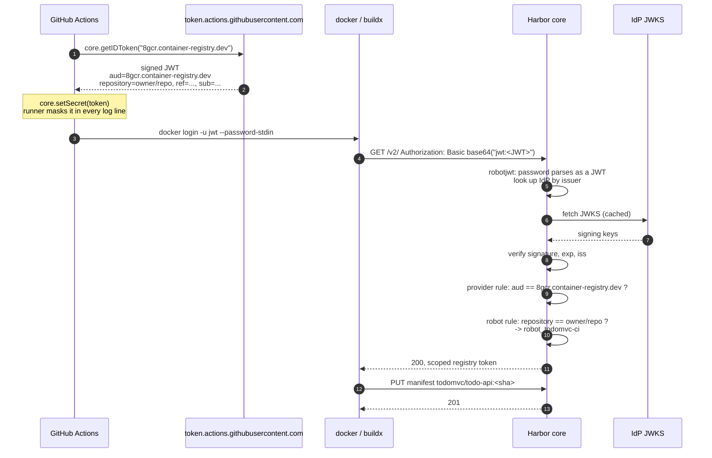

# Container images, pushed keylessly

[← Maven](04-maven.md) · [Pipeline →](06-pipeline.md)

Container images go into the plain `todomvc` project over the ordinary OCI API.
Nothing about the registry side is unusual. What is unusual is that the pipeline
holds no registry password, and none is stored in GitHub.

Unlike npm and Maven, this part works against `8gcr.container-registry.dev`
today. The gaps in [00-environment.md](00-environment.md) do not touch `/v2/`.

## There is no token exchange

This is the single fact to take away, because most OIDC integrations do not work
this way.

The pipeline asks GitHub for an OIDC JWT and then uses that JWT **directly as the
HTTP Basic password**. There is no call to a token endpoint, no exchange for a
registry-issued credential, no intermediate service, and no `AssumeRoleWithWebIdentity`
equivalent.

```bash
printf '%s' "$OIDC_JWT" | docker login 8gcr.container-registry.dev -u jwt --password-stdin
```

The username is ignored. `jwt` is a convention that makes logs readable.

Harbor's `robotjwt` authenticator sees that the Basic password parses as a JWT,
reads its issuer, finds the federated IdP registered for that issuer, validates
the signature against that provider's JWKS, and then matches the token's claims
against the configured claim rules to decide which robot account it is. From that
point on the request is an ordinary robot request with that robot's project
permissions.



Steps 9 and 10 are the whole security model. A token that fails the provider rule
is rejected outright. A token that passes it but matches no robot rule
authenticates as nobody. Only a token carrying both the right audience and the
right `repository` claim becomes `robot_todomvc-ci`. The rules themselves are
created in [02-harbor-setup.md](02-harbor-setup.md).

## Why the audience is the registry hostname

GitHub will mint a token for any audience the workflow asks for. Requesting the
registry hostname, and pinning a provider-wide rule to that exact value, means a
token minted for some other service, say a cloud provider, cannot be replayed
against this registry. It also means a token minted for this registry is
worthless anywhere else.

[`.github/actions/8gcr-token/action.yml`](../.github/actions/8gcr-token/action.yml)
takes the audience as its only input, and every caller passes `env.REGISTRY`.

## Masking: `core.setSecret()`

The token is a working credential for as long as it lives, which is minutes. If it
reaches a log, anybody who can read that log can push to the registry until it
expires.

```javascript
const token = await core.getIDToken(core.getInput('audience'));
// Register the value with the runner's log scrubber BEFORE it can be emitted
// anywhere. Without this, any step that echoes it, or a failing curl that dumps
// its arguments, leaks a valid credential.
core.setSecret(token);
core.setOutput('password', token);
```

`core.setSecret()` registers the value with the runner's log scrubber, so every
subsequent occurrence of it in any step's output is replaced with `***`. Ordering
matters: it is called before `setOutput`, so the value is already masked by the
time it exists anywhere the runner could print it.

The same applies to anything derived from it. The npm job base64-encodes the token
into an `_auth` string, and that string is a credential too, so it is masked
explicitly:

```bash
# base64 -w0 is GNU-only; macOS needs -b0. Piping through tr works on both.
auth="$(printf 'jwt:%s' "$HARBOR_PASSWORD" | base64 | tr -d '\n')"
echo "::add-mask::$auth"
```

Masking a value does not mask its transformations. Every derived form needs its
own `add-mask`.

## Pushing

```bash
docker build -t 8gcr.container-registry.dev/todomvc/todo-api:$(git rev-parse HEAD) apps/todo-api
docker push 8gcr.container-registry.dev/todomvc/todo-api:$(git rev-parse HEAD)
```

In CI this is `docker/build-push-action`, tagging each image twice, with the
commit sha and with `latest`. The commit sha tag is the one worth pulling by; see
[06-pipeline.md](06-pipeline.md).

The robot needs `repository:push`, `repository:pull`, `artifact:read` and
`tag:create` on `todomvc`. Missing `tag:create` produces a push that uploads all
the blobs and then fails on the manifest, which is a confusing way to find out.

## Pulling back

The pipeline's `verify` job logs in with a freshly minted token, on a clean
runner, and pulls both images by digest-bearing tag:

```bash
printf '%s' "$OIDC_JWT" | docker login 8gcr.container-registry.dev -u jwt --password-stdin
docker pull 8gcr.container-registry.dev/todomvc/todo-api:<sha>
docker pull 8gcr.container-registry.dev/todomvc/todo-ui:<sha>
```

A pull with a different token than the push is the point: it shows the identity is
reconstructed from claims each time, not carried over from the push.

## Doing it without GitHub

Any OIDC issuer works. Register it with `POST /api/v2.0/federated-idps`, add claim
rules that match whatever claims it emits, and hand its token to `docker login` as
the password. Nothing in the Harbor side is GitHub-specific; the only GitHub
detail is `core.getIDToken()` and the `repository` claim name.

## Next

- [06-pipeline.md](06-pipeline.md): all of this wired together
