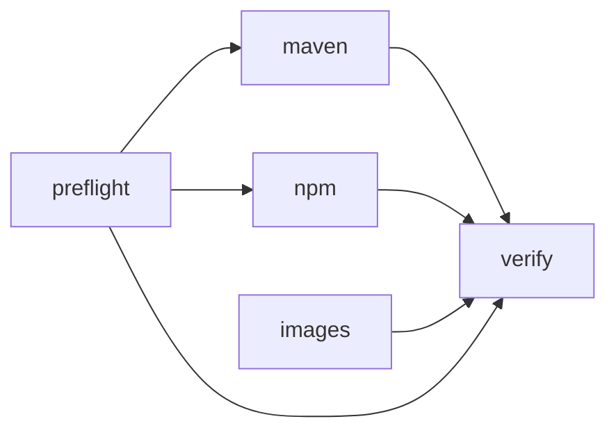

# The pipeline

[← Images and WIF](05-images-wif.md) · [Concepts](01-concepts.md)

[`.github/workflows/build.yml`](../.github/workflows/build.yml) builds both apps
and publishes three kinds of artifact into one registry, with no stored secret.
This page walks it job by job.



`images` has no dependency on `preflight`, because OCI push does not depend on
the package endpoints being routed.

## Top of the file

```yaml
permissions:
  contents: read
  id-token: write        # required to mint the GitHub OIDC token
```

`id-token: write` is the permission that allows `core.getIDToken()` to work.
Without it the token request fails and every job that authenticates dies at the
first step. It is not granted by default, and it is the only permission this
workflow needs beyond reading the repository.

```yaml
env:
  REGISTRY: 8gcr.container-registry.dev
  NPM_PROJECT: todomvc-npm
  MAVEN_PROJECT: todomvc-maven
  IMAGE_PROJECT: todomvc
```

`REGISTRY` is used both as the hostname and as the OIDC audience, which is what
ties the token to this registry. See [05-images-wif.md](05-images-wif.md).

## `preflight`

This job exists because of a specific failure mode, and it is worth understanding
rather than copying.

Harbor core serves `/npm/` and `/maven/`, but the ingress in front of core decides
whether those paths ever reach it. A deployment can have the feature compiled in
and still route those paths to the web UI, which answers with 785 bytes of
`index.html` and HTTP 200. npm then tries to parse that HTML as a packument and
reports a JSON parse error partway through an install; Maven reports something
equally unhelpful. The cause and the symptom look nothing alike, and this is the
current state of `8gcr.container-registry.dev`
([00-environment.md](00-environment.md)).

The probe checks the content type, not the status code:

```bash
probe() {  # "true" if a package API answered, "false" if the UI did
  ct="$(curl -sS -o /dev/null -w '%{content_type}' "$1" || true)"
  case "$ct" in
    *text/html*|"") echo "false" ;;
    *)              echo "true"  ;;
  esac
}
```

A 200 with `text/html` is the failure. A 401 with `application/json` is a success
as far as this probe is concerned, because it proves the request reached core.

The two outputs, `npm_ready` and `maven_ready`, gate the later jobs. When an
endpoint is unreachable the workflow does not fail; it builds against the upstream
registry instead, emits a `::warning::` naming the cause, and writes a small table
to the job summary. That keeps the repository buildable while the deployment gaps
are open, and makes the reason visible in one line instead of buried in an npm
stack trace.

## `maven`

```yaml
- id: auth
  if: needs.preflight.outputs.maven_ready == 'true'
  uses: ./.github/actions/8gcr-token
  with:
    audience: ${{ env.REGISTRY }}
```

The composite action mints the OIDC token and returns it as
`steps.auth.outputs.password`, with `steps.auth.outputs.username` fixed to `jwt`.
It calls `core.setSecret()` on the token first, so the value is masked in logs
before it can be printed anywhere.

The build step branches on the probe:

```bash
if [ "${{ needs.preflight.outputs.maven_ready }}" = "true" ]; then
  mvn -B -s .mvn/settings.xml verify     # everything through the proxy cache
else
  mvn -B verify                          # straight to Maven Central
fi
```

The settings file is what redirects resolution, via `mirrorOf=*`, and it is also
what supplies credentials, via the `<server>` entry whose id matches. Dropping the
`-s` flag drops both at once, which is why there is no partial mode.

Publishing sets the version first:

```bash
mvn -B -s .mvn/settings.xml versions:set -DnewVersion="0.1.${{ github.run_number }}" -DgenerateBackupPoms=false
mvn -B -s .mvn/settings.xml deploy -DskipTests
```

Release versions are immutable in Harbor, so redeploying `0.1.0` on every run
would be a conflict from the second run onward. `github.run_number` gives a
monotonic version per run, so a rerun publishes something new and observable
rather than colliding. Details in [04-maven.md](04-maven.md).

Publishing is also gated on `github.event_name != 'pull_request'`: pull requests
build and resolve through the registry but do not write to it.

## `npm`

Same shape. The authentication step is the one worth reading:

```bash
auth="$(printf 'jwt:%s' "$HARBOR_PASSWORD" | base64 -w0)"
echo "::add-mask::$auth"
echo "//$REGISTRY/npm/$NPM_PROJECT/:_auth=$auth" >> .npmrc
```

Three deliberate details:

- `_auth`, not `_authToken`. Harbor's npm endpoint takes HTTP Basic. `_authToken`
  sends a Bearer header and gets a 401, despite what the portal's Usage tab
  suggests ([03-npm.md](03-npm.md)).
- `add-mask` on the base64 string. The token itself is already masked, but its
  base64 encoding is a different string and is an equally usable credential.
- The line is appended to the committed
  [`.npmrc`](../apps/todo-ui/.npmrc), which already carries the `registry=` line.
  Nothing secret is committed; the credential is added at runtime and lives only
  on the runner.

Install and publish then need no registry flags at all, because `.npmrc` decides
where both go.

## `images`

A matrix over the two apps. No `needs: preflight`, because `/v2/` is routed
everywhere.

```bash
printf '%s' "$HARBOR_PASSWORD" | docker login "$REGISTRY" -u "$HARBOR_USERNAME" --password-stdin
```

The token is passed through the environment and piped on stdin, not placed on the
command line. A command line is visible in a process listing and in `set -x`
output; stdin is not.

```yaml
push: ${{ github.event_name != 'pull_request' }}
provenance: false
tags: |
  ${{ env.REGISTRY }}/${{ env.IMAGE_PROJECT }}/${{ matrix.app }}:${{ github.sha }}
  ${{ env.REGISTRY }}/${{ env.IMAGE_PROJECT }}/${{ matrix.app }}:latest
```

`provenance: false` keeps buildx from attaching an attestation manifest, which
turns a plain image into an index with an extra artifact. It is off here to keep
the demo's registry contents simple to read; turn it on when you want the
attestations.

Both tags point at the same image. `latest` is for humans, the commit sha is what
`verify` pulls.

Note that the `todo-api` image builds Maven inside the Dockerfile, using the same
`.mvn/settings.xml`. That stage therefore also resolves through the registry, and
it has no fallback: see the comment at the top of
[`apps/todo-api/Dockerfile`](../apps/todo-api/Dockerfile).

## `verify`

Publishing that is never read back proves nothing. This job runs on a clean
runner, mints a **new** token, and pulls all three artifact kinds.

```yaml
needs: [preflight, maven, npm, images]
if: github.event_name != 'pull_request'
```

- **Images**: `docker login` with the fresh token, then `docker pull` by commit
  sha. A different token from the one that pushed, which shows the identity is
  reconstructed from claims on each request.
- **npm**: writes a throwaway `.npmrc` in a temp directory, then `npm view` and
  `npm pack` the version just published. The temp directory means a cold npm
  cache.
- **Maven**: `dependency:get` with `-Dmaven.repo.local="$(mktemp -d)"`. Without
  that flag the request could be satisfied from `~/.m2` and prove nothing.

The npm and Maven checks are skipped when the corresponding preflight output is
false, so the job stays green while those endpoints are unroutable, and starts
proving something the moment they are fixed.

## Running it against your own registry

1. Change `REGISTRY` and the three project names in the `env:` block.
2. Run [`scripts/setup-8gcr.sh`](../scripts/setup-8gcr.sh) against your instance
   with `GITHUB_REPO` set to your fork, so the claim rule matches.
3. Update the hard-coded hostname in
   [`apps/todo-ui/.npmrc`](../apps/todo-ui/.npmrc),
   [`apps/todo-ui/package.json`](../apps/todo-ui/package.json) (`publishConfig`),
   [`apps/todo-api/.mvn/settings.xml`](../apps/todo-api/.mvn/settings.xml) and the
   `harbor.registry` property in [`apps/todo-api/pom.xml`](../apps/todo-api/pom.xml).

No secret needs to be added to the repository. That is the entire point.

## Related

- [01-concepts.md](01-concepts.md)
- [02-harbor-setup.md](02-harbor-setup.md)
- [03-npm.md](03-npm.md)
- [04-maven.md](04-maven.md)
- [05-images-wif.md](05-images-wif.md)
