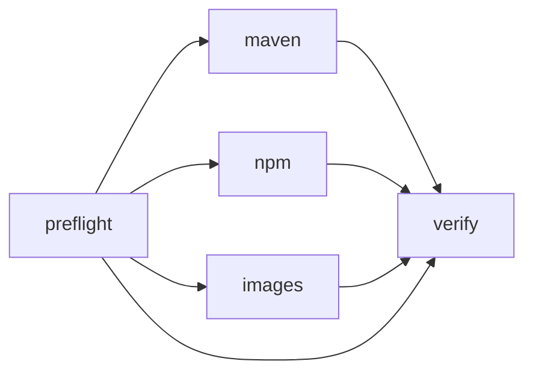

# The pipeline

[← Images and WIF](05-images-wif.md) · [Concepts](01-concepts.md)

Three files build both apps and publish three kinds of artifact into one
registry, with no stored secret:

| File | Trigger | Grants `id-token: write` |
|---|---|---|
| [`_pipeline.yml`](../.github/workflows/_pipeline.yml) | `workflow_call` | no, it inherits |
| [`build.yml`](../.github/workflows/build.yml) | `pull_request` | **no** |
| [`publish.yml`](../.github/workflows/publish.yml) | push to `main`, manual | yes |

The work lives once, in the reusable `_pipeline.yml`. The two entry points differ
in one thing that matters, and it is the reason for the split: what they are
allowed to do. See [below](#why-the-split). This page walks the pipeline job by
job.



`images` needs `preflight` as well. The push itself does not depend on the
package endpoints, but the two Dockerfiles resolve dependencies during the build,
so they take the same routing decision as the `maven` and `npm` jobs.

## Why the split

A pull request runs code from the branch under review: Maven plugins, npm
lifecycle scripts, `RUN` layers in a Dockerfile. If the job holding that code can
mint a registry credential, then so can the code.

The first version of this pipeline tried to solve that with a step condition:

```yaml
# NOT sufficient
permissions:
  id-token: write
steps:
  - if: github.event_name != 'pull_request'
    uses: ./.github/actions/8gcr-token
```

That does not work. Granting `id-token: write` puts `ACTIONS_ID_TOKEN_REQUEST_URL`
and `ACTIONS_ID_TOKEN_REQUEST_TOKEN` into the job environment for **every** step,
so any build script in the job can request a token itself with two lines of curl.
Skipping the step that mints one changes nothing. A step condition is not a
permission boundary; the job's permission set is.

The boundary has to be the grant, and permissions cannot be set from an
expression. Hence two callers:

```yaml
# build.yml, on: pull_request
jobs:
  pipeline:
    uses: ./.github/workflows/_pipeline.yml
    permissions:
      contents: read          # no id-token, at all
    with:
      publish: false
```

```yaml
# publish.yml, on: push to main + workflow_dispatch
jobs:
  pipeline:
    if: github.ref == 'refs/heads/main'
    uses: ./.github/workflows/_pipeline.yml
    permissions:
      contents: read
      id-token: write         # the only grant in the repository
    with:
      publish: true
```

The `if` is not decoration. `workflow_dispatch` lets a maintainer choose any ref,
so without it someone could run an unmerged branch's build code with
`id-token: write` and `publish: true`, which is exactly the boundary the split
exists to draw. The push trigger is already main-only; the guard constrains the
manual path.

A called workflow can never hold more than its caller granted, so on a pull
request the token endpoint is not reachable from any step, whatever the branch's
build scripts try. `_pipeline.yml` deliberately declares no `permissions` block
of its own; declaring one would fail the run rather than elevate it.

Everything inside the pipeline keys off the `publish` input rather than the event
name, so the two paths cannot drift apart.

## Pinned actions

Every third-party action is pinned to a full commit SHA with the version in a
trailing comment:

```yaml
- uses: docker/build-push-action@10e90e3645eae34f1e60eeb005ba3a3d33f178e8 # v6.19.2
```

A tag is a mutable pointer. In a publish run the Docker actions execute after
`docker login`, so a moved tag would run unreviewed code on a runner that is
holding a registry credential. Pinning costs a dependency-update job later, which
is the right trade here.

## Environment

```yaml
env:
  REGISTRY: 8gcr.container-registry.dev
  REGISTRY_SCHEME: https
  NPM_PROJECT: todomvc-npm
  MAVEN_PROJECT: todomvc-maven
  IMAGE_PROJECT: todomvc
```

One place to repoint the whole repository at a different registry. `REGISTRY_SCHEME`
is separate because the probe below builds package URLs from it: against a registry
on plain HTTP, a hard-coded `https` reports both endpoints not ready and the build
falls back to the upstream registries without ever saying why.

## Artifact versions

Release versions are immutable in the registry, so every run has to publish a
coordinate it has not used before:

```bash
v="0.1.${{ github.run_number }}"
[ "${{ github.run_attempt }}" = "1" ] || v="$v-rc${{ github.run_attempt }}"
```

`run_number` does not change when you press "re-run", so the attempt is folded in
as a semver prerelease, which both npm and Maven accept.

This is computed **inside each publishing job**, not once in `preflight`, and the
reason is worth knowing if you copy the pattern. "Re-run failed jobs" increments
`github.run_attempt` but does not re-run a job that already succeeded. A version
carried on a `preflight` output would therefore still hold attempt 1's value on
attempt 2, and the rerun would republish an immutable coordinate and get a 409,
which is the exact failure the versioning was meant to avoid.

Each publisher exposes what it used as a job output, and `verify` reads them
separately, so re-running only the npm job does not change the coordinate the
Maven job already published:

```yaml
npm view "todomvc-todo-ui@${{ needs.npm.outputs.version }}"
mvn dependency:get -Dartifact="...:${{ needs.maven.outputs.version }}"
```

## `preflight`

This job exists because of a specific failure mode, and it is worth understanding
rather than copying.

Harbor core serves `/npm/` and `/maven/`, but the ingress in front of core decides
whether those paths ever reach it. A deployment can have the feature compiled in
and still route those paths to the web UI, which answers with `index.html` and
HTTP 200. npm then tries to parse that HTML as a packument and reports a JSON
parse error partway through an install; Maven saves the HTML as a `.pom` and
fails with `Expected root element 'project' but found 'html'`. The cause and the
symptom look nothing alike.

The probe checks the status and the content type, and bounds itself in time:

```bash
probe() {  # "true" only if a package API really answered
  read -r code ct <<<"$(curl -sS --connect-timeout 10 --max-time 30 \
    -o /dev/null -w '%{http_code} %{content_type}' "$1" || echo '000 -')"
  case "$ct" in *text/html*) echo "false"; return ;; esac
  case "$code" in
    200|404) echo "true"  ;;
    *)       echo "false" ;;
  esac
}
```

The content type is the routing signal, and the status narrows it. On a working
instance the two probed URLs do not answer alike:

| Probed URL | Response | Verdict |
|---|---|---|
| `/npm/todomvc-npm/` | `200 application/json` (`{}`) | ready |
| `/maven/todomvc-maven` | `404 text/plain` (19 bytes) | ready |
| `/mavenx/todomvc-maven` | `200 text/html` | not ready, the portal answered |
| `/maven/no-such-project` | `401 application/json` | not ready |

A Maven project has nothing at its own root even when it is perfectly healthy, so
`404 text/plain` is the routed answer there and demanding a `200` would report a
working registry as broken. The 401 case is rejected on purpose: it proves the
endpoint is there, but the image builds resolve dependencies inside
`docker build`, which receives no credentials, so pointing them at a project that
demands authentication only moves the failure. This demo keeps its package
projects public.

The timeouts matter because an endpoint can accept a connection and then never
respond, which would hang `preflight` and with it every job waiting on it.

The two outputs, `npm_ready` and `maven_ready`, gate the later jobs. When an
endpoint is unreachable the workflow does not fail; it builds against the upstream
registry instead, emits a `::warning::`, and writes a small table to the job
summary carrying the observed status and content type. That keeps the repository
buildable through a registry outage, and makes the reason visible in one line
instead of buried in an npm stack trace.

## `maven`

```yaml
- id: auth
  if: needs.preflight.outputs.maven_ready == 'true' && inputs.publish
  uses: ./.github/actions/8gcr-token
  with:
    audience: ${{ env.REGISTRY }}
```

`inputs.publish` is false on a pull request, so nothing is minted there. That
condition is a convenience, not the safeguard; the safeguard is that the calling
workflow never granted the permission (see [Why the split](#why-the-split)).

The composite action mints the OIDC token and returns it as
`steps.auth.outputs.password`, with `steps.auth.outputs.username` fixed to `jwt`.
It calls `core.setSecret()` on the token first, so the value is masked in logs
before it can be printed anywhere.

The build step branches on the probe:

```bash
if [ "${{ needs.preflight.outputs.maven_ready }}" = "true" ]; then
  if mvn -B -s .mvn/settings.xml verify; then   # everything through the proxy cache
    exit 0
  fi
  echo "::warning::Build through the registry failed; retrying against Maven Central."
fi
mvn -B verify                                    # straight to Maven Central
```

Note the retry. A reachable endpoint is not proof it can serve a whole dependency
tree: the Maven proxy stops fetching cold coordinates without saying so
([04-maven.md](04-maven.md#the-failure-mode-to-know-about)). Falling back keeps
the build honest about where the packages came from instead of failing opaquely.
The npm job does the same, for the partial packuments in
[03-npm.md](03-npm.md#where-the-proxy-cache-is-still-rough-partial-packuments).

The settings file is what redirects resolution, via `mirrorOf=*`, and it is also
what supplies credentials, via the `<server>` entry whose id matches. Dropping the
`-s` flag drops both at once, which is why there is no partial mode.

Publishing sets the version first:

```bash
mvn -B -s "$settings" versions:set -DnewVersion="${{ steps.version.outputs.version }}" -DgenerateBackupPoms=false
mvn -B -s "$settings" deploy -DskipTests
```

Two things carry over from the build step above. `$settings` is whichever settings
file actually resolved, so a publish never goes through a mirror that just failed.
`steps.version.outputs.version` is this job's own version step, not a shared one;
see [Artifact versions](#artifact-versions) for why it is computed per publisher
rather than once in `preflight`. Details on Maven immutability in
[04-maven.md](04-maven.md).

Publishing is gated on `inputs.publish`: pull requests build and resolve, but do
not write to the registry.

## `npm`

Same shape. The authentication step is the one worth reading:

```bash
# base64 -w0 is GNU-only; macOS needs -b0. Piping through tr works on both.
auth="$(printf 'jwt:%s' "$HARBOR_PASSWORD" | base64 | tr -d '\n')"
echo "::add-mask::$auth"
echo "//$REGISTRY/npm/$NPM_PROJECT/:_auth=$auth" >> .npmrc
```

Three deliberate details:

- `_auth`, not `_authToken`. Harbor's npm endpoint takes HTTP Basic. `_authToken`
  sends a Bearer header and gets a 401, despite what the portal's Usage tab
  suggests ([03-npm.md](03-npm.md)).
- `add-mask` on the base64 string. The token itself is already masked, but its
  base64 encoding is a different string and is an equally usable credential.
- The line is appended to the committed
  [`.npmrc`](../apps/todo-ui/.npmrc), which already carries the `registry=` line.
  Nothing secret is committed; the credential is added at runtime and lives only
  on the runner.

Install and publish then need no registry flags at all, because `.npmrc` decides
where both go.

## `images`

A matrix over the two apps. It takes `needs: preflight` so the in-image
dependency resolution can be pointed at the registry only when the endpoints
answer; the push to `/v2/` itself works regardless.

The Dockerfiles default to upstream registries and the job passes a build-arg to
override that:

```yaml
build-args: |
  ${{ matrix.app == 'todo-api' && needs.preflight.outputs.maven_ready == 'true' && 'MAVEN_SETTINGS=.mvn/settings.xml' || '' }}
```

The retry lives in `apps/todo-api/Dockerfile` rather than here, because the job that
learns whether the mirror can serve a whole tree is a different job and its result is
not available at this point. Without it, a degraded proxy cache fails the image build
outright while every other job degrades politely.

Note that the build stage receives no registry credentials. `docker build` does
not inherit the job's environment, so dependency resolution inside the image
relies on the package projects being **public**. Keep them public, or pass
credentials in explicitly with build secrets.

```bash
printf '%s' "$HARBOR_PASSWORD" | docker login "$REGISTRY" -u "$HARBOR_USERNAME" --password-stdin
```

The token is passed through the environment and piped on stdin, not placed on the
command line. A command line is visible in a process listing and in `set -x`
output; stdin is not.

```yaml
push: ${{ inputs.publish }}
provenance: false
tags: |
  ${{ env.REGISTRY }}/${{ env.IMAGE_PROJECT }}/${{ matrix.app }}:${{ github.sha }}
  ${{ env.REGISTRY }}/${{ env.IMAGE_PROJECT }}/${{ matrix.app }}:latest
```

`provenance: false` keeps buildx from attaching an attestation manifest, which
turns a plain image into an index with an extra artifact. It is off here to keep
the demo's registry contents simple to read; turn it on when you want the
attestations.

Both tags point at the same image. `latest` is for humans, the commit sha is what
`verify` pulls.

Note that the `todo-api` image builds Maven inside the Dockerfile, using the same
`.mvn/settings.xml`. That stage therefore also resolves through the registry, and
it has no fallback: see the comment at the top of
[`apps/todo-api/Dockerfile`](../apps/todo-api/Dockerfile).

## `verify`

Publishing that is never read back proves nothing. This job runs on a clean
runner, mints a **new** token, and pulls all three artifact kinds.

```yaml
needs: [preflight, maven, npm, images]
if: inputs.publish
```

- **Images**: `docker login` with the fresh token, then `docker pull` by commit
  sha. A different token from the one that pushed, which shows the identity is
  reconstructed from claims on each request.
- **npm**: writes a throwaway `.npmrc` in a temp directory, then `npm view` and
  `npm pack` the version just published. The temp directory means a cold npm
  cache.
- **Maven**: `dependency:get` with `-Dmaven.repo.local="$(mktemp -d)"`. Without
  that flag the request could be satisfied from `~/.m2` and prove nothing.

The npm and Maven checks are skipped when the corresponding preflight output is
false, so the job stays green while those endpoints are unroutable, and starts
proving something the moment they are fixed.

## Running it against your own registry

1. Change `REGISTRY`, and `REGISTRY_SCHEME` if your instance is not on HTTPS, plus
   the three project names in the `env:` block.
2. Run [`scripts/setup-8gcr.sh`](../scripts/setup-8gcr.sh) against your instance
   with `GITHUB_REPO` set to your fork, so the claim rule matches. Note the audience
   it prints: it is the host from `HARBOR_URL` with the port, and the workflow has to
   request that same string.
3. Update the hard-coded URL, scheme included, in
   [`apps/todo-ui/.npmrc`](../apps/todo-ui/.npmrc) and
   [`.npmrc.example`](../apps/todo-ui/.npmrc.example),
   [`apps/todo-ui/package.json`](../apps/todo-ui/package.json) (`publishConfig`),
   [`apps/todo-ui/README.md`](../apps/todo-ui/README.md),
   [`apps/todo-api/.mvn/settings.xml`](../apps/todo-api/.mvn/settings.xml), and
   `distributionManagement` plus the `harbor.registry` property in
   [`apps/todo-api/pom.xml`](../apps/todo-api/pom.xml).

No secret needs to be added to the repository. That is the entire point.

## Related

- [01-concepts.md](01-concepts.md)
- [02-harbor-setup.md](02-harbor-setup.md)
- [03-npm.md](03-npm.md)
- [04-maven.md](04-maven.md)
- [05-images-wif.md](05-images-wif.md)
