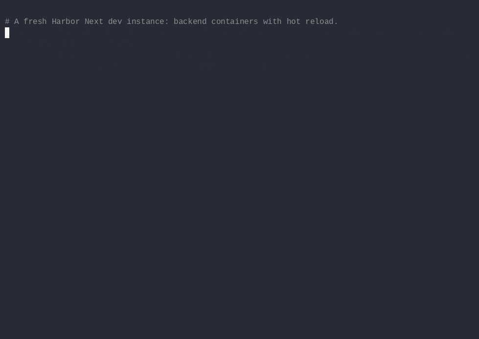
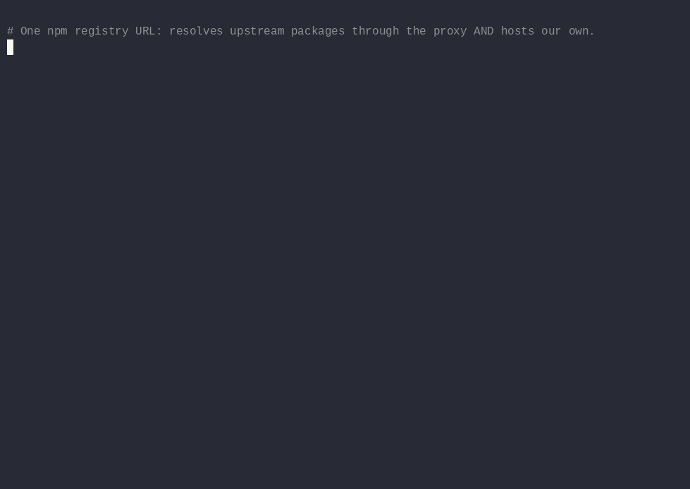
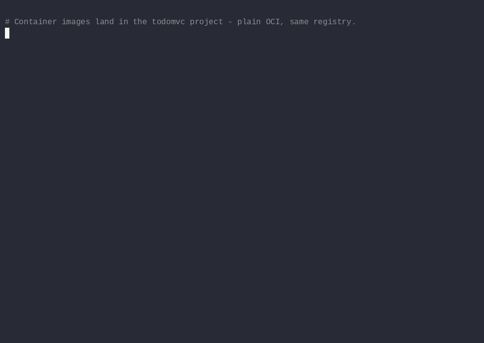
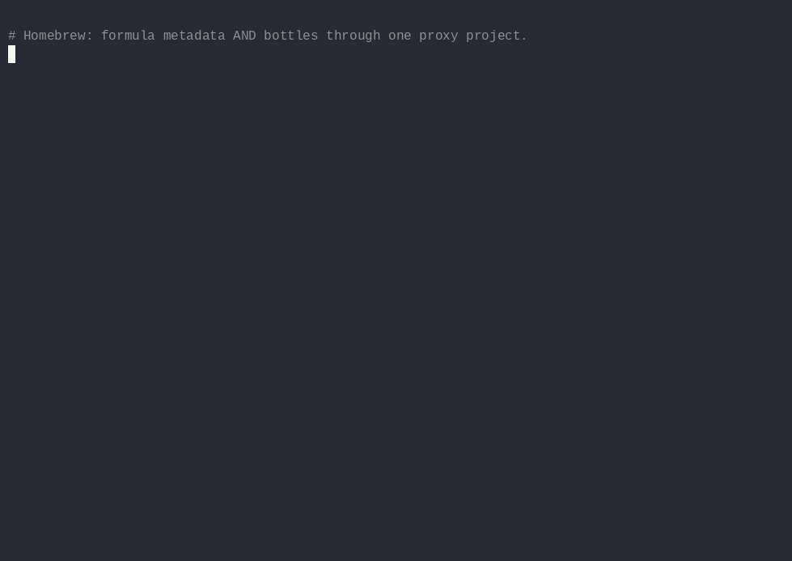

# Recorded demos

Every flow in this repository, recorded end to end with
[asciinema](https://asciinema.org/) against a **freshly wiped** local Harbor
Next dev instance (`localhost:8080`, state volumes deleted first — nothing
was cached, nothing pre-created except what each recording shows). The
scripts that produced them are in [`scripts/`](scripts/) and print every
command before running it, so each recording doubles as a copy-pasteable
walkthrough.

Formats per demo: an animated GIF (inline below), an `.mp4`, and the
original `.cast` (replay locally with `asciinema play <file>.cast`;
long pauses are capped at 2 s).

## 00 — Fresh setup

Backend containers up, wait for core, enable the multi-format feature gate,
provision endpoints and projects with `scripts/setup-8gcr.sh`.
[mp4](00-fresh-setup.mp4) · [cast](00-fresh-setup.cast) · [script](scripts/00-fresh-setup.sh)



## 01 — npm

Upstream-complete packument on a cold cache, exact-pin install of a
never-cached version, `npm ci` + build through the proxy, publish our own
package, cold pull-back. See [03-npm.md](../03-npm.md).
[mp4](01-npm.mp4) · [cast](01-npm.cast) · [script](scripts/01-npm.sh)



## 02 — Maven

Cold GAV pull-through with checksums, then the real test: `mvn verify` with
an **empty local repository** — every dependency and plugin resolves through
Harbor — followed by a release deploy and a mirror-less cold pull-back.
See [04-maven.md](../04-maven.md).
[mp4](02-maven.mp4) · [cast](02-maven.cast) · [script](scripts/02-maven.sh)


## 03 — Images

Build the todo-ui image, push it to the `todomvc` project, forget the local
copy, pull it back. See [05-images-wif.md](../05-images-wif.md).
[mp4](03-images.mp4) · [cast](03-images.cast) · [script](scripts/03-images.sh)



## 04 — Homebrew

Create the Homebrew endpoint and proxy project, fetch formula metadata,
resolve a bottle digest from the version manifest, cold pull (round-trips to
GHCR) vs warm pull (served from Harbor, ~10× faster, byte-identical), and
where it lands: repository, pull count, audit log.
[mp4](04-homebrew.mp4) · [cast](04-homebrew.cast) · [script](scripts/04-homebrew.sh)



## Reproducing

```bash
# 00 needs a harbor checkout for the compose file:
HARBOR_SRC=~/code/harbor ./scripts/00-fresh-setup.sh
# the rest run from anywhere inside this repo:
./scripts/01-npm.sh
./scripts/02-maven.sh
./scripts/03-images.sh
./scripts/04-homebrew.sh
```

Recorded 2026-08-31 with `asciinema rec --headless --window-size 100x30 -i 2`,
rendered with `agg`, converted with `ffmpeg`.
